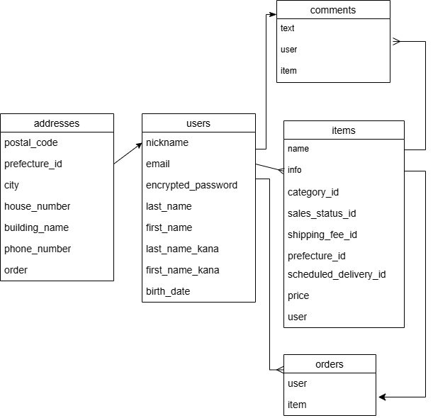

## ER図

## users テーブル
|Column               |Type     |Options     |
|---------------------|---------|------------|
| nickname	          | string  |	null: false|
| email	              | string	| null: false, unique: true|
| encrypted_password	| string	| null: false|
| last_name	          | string	| null: false|
| first_name          |	string	| null: false|
| last_name_kana	    | string	| null: false|
| first_name_kana	    | string	| null: false|
| birth_date	        | date	  | null: false|

### Association
has_many :items
has_many :comments
has_many :orders

## items テーブル
|Column                       |Type         |Options     |
|-----------------------------|-------------|------------|
| item_name	                  | string	    | null: false|
| item_info	                  | text	      | null: false|
| item_category_id	          | integer	    | null: false|
| item_sales_status_id	      | integer	    | null: false|
| item_shipping_fee_status_id	| integer	    | null: false|
| item_prefecture_id	        | integer	    | null: false|
| item_scheduled_delivery_id	| integer	    | null: false|
| item_price	                | integer	    | null: false|
| user	                      | references	| null: false, foreign_key: true|

### Association
belongs_to :user
has_many :comments
has_one :order

## comments テーブル
|Column |Type         |Options     |
|-------|-------------|------------|
| text	| text	      | null: false|
| user	| references	| null: false, foreign_key: true|
| item	| references	| null: false, foreign_key: true|

### Association
belongs_to :user
belongs_to :item

## orders テーブル
|Column |Type         |Options     |
|-------|-------------|------------|
| user	| references	| null: false, foreign_key: true|
|item 	| references	| null: false, foreign_key: true|

### Association
belongs_to :user
belongs_to :item
has_one :address

## addresses テーブル
|Column         |Type         |Options     |
|---------------|-------------|------------|
| postal_code	  | string	    | null: false|
| prefecture_id	| integer	    | null: false|
| city	        | string	    | null: false|
| addresses	    | string	    | null: false|
| building	    | string	    | |
| phone_number	| string	    | null: false|
| order	        | references	| null: false, foreign_key: true|

### Association
belongs_to :order

